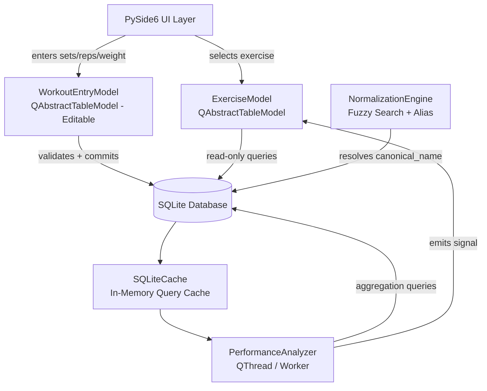
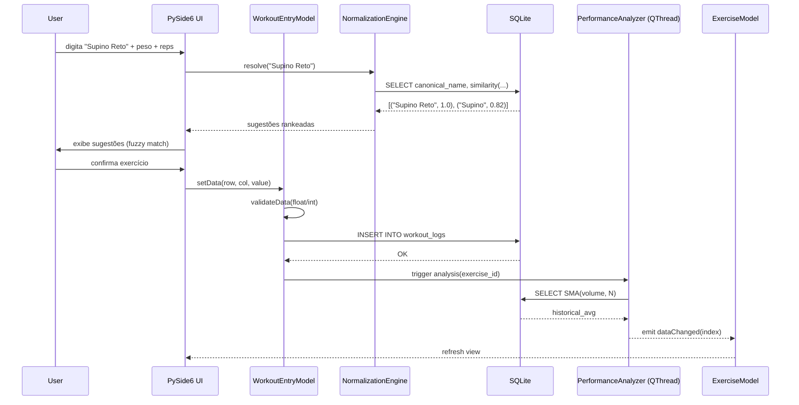
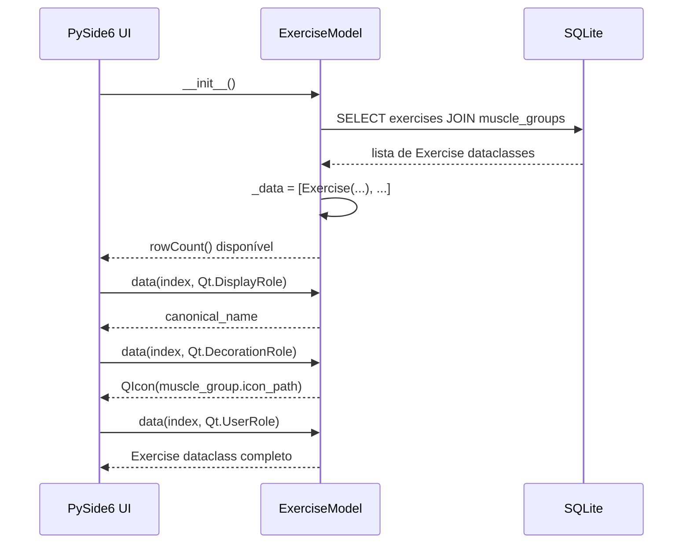

# Design Document: GYMNight Performance Engine

## Overview

O GYMNight Performance Engine é um motor de análise temporal de performance de treinos que compara o Volume atual (V = peso × reps × séries) contra a média histórica do usuário. O sistema resolve dois problemas centrais: a fragmentação de identidade de exercícios causada por entrada de texto livre, e a necessidade de uma UI responsiva enquanto análises de dados rodam em background.

O motor é construído sobre SQLite com schema otimizado para consultas de agregação temporal, exposto à camada de apresentação via `QAbstractTableModel` do PySide6, garantindo integração nativa com o loop de eventos do Qt sem polling.

## Architecture



## Sequence Diagrams

### Fluxo: Usuário registra uma série de treino



### Fluxo: Carregamento inicial de exercícios



## Components and Interfaces

### Component 1: NormalizationEngine

**Purpose**: Resolver texto livre do usuário para um `canonical_name` existente ou criar novo exercício, evitando fragmentação de dados.

**Interface**:
```python
class NormalizationEngine:
    def resolve(self, user_input: str, threshold: float = 0.75) -> list[ExerciseMatch]
    def get_or_create(self, user_input: str, muscle_group_id: int) -> Exercise
    def _trigram_similarity(self, a: str, b: str) -> float
    def _normalize_text(self, text: str) -> str  # lowercase, strip accents
```

**Responsibilities**:
- Normalizar texto (lowercase, remover acentos, trim)
- Calcular similaridade trigram entre input e nomes canônicos existentes
- Retornar lista rankeada de sugestões acima do threshold
- Criar novo exercício com `canonical_name` normalizado se nenhuma sugestão for aceita

### Component 2: ExerciseModel

**Purpose**: Modelo read-only para listagem e seleção de exercícios na UI, thread-safe.

**Interface**:
```python
class ExerciseModel(QAbstractTableModel):
    def rowCount(self, parent: QModelIndex = QModelIndex()) -> int
    def columnCount(self, parent: QModelIndex = QModelIndex()) -> int
    def data(self, index: QModelIndex, role: int = Qt.DisplayRole) -> Any
    def headerData(self, section: int, orientation: Qt.Orientation, role: int) -> Any
    def refresh_from_db(self) -> None  # thread-safe via QMutex
    def _on_analysis_complete(self, exercise_id: int) -> None  # slot
```

### Component 3: WorkoutEntryModel

**Purpose**: Modelo editável para entrada de séries/reps/peso, com validação de tipos antes de commit.

**Interface**:
```python
class WorkoutEntryModel(QAbstractTableModel):
    def flags(self, index: QModelIndex) -> Qt.ItemFlags
    def setData(self, index: QModelIndex, value: Any, role: int = Qt.EditRole) -> bool
    def _validate_weight(self, value: Any) -> float | None
    def _validate_reps(self, value: Any) -> int | None
    def _commit_set(self, row: int) -> bool
    def insertRow(self, row: int, parent: QModelIndex = QModelIndex()) -> bool
```

### Component 4: PerformanceAnalyzer

**Purpose**: Worker QThread que executa queries de agregação (SMA) sem bloquear a UI.

**Interface**:
```python
class PerformanceAnalyzer(QObject):
    analysis_complete = Signal(int, PerformanceResult)  # exercise_id, result

    def analyze(self, exercise_id: int, window_n: int = 5) -> None
    def _compute_sma_volume(self, exercise_id: int, n: int) -> list[float]
    def _compute_current_volume(self, exercise_id: int, session_id: int) -> float
```

## Data Models

### Model: Exercise (Dataclass)

```python
@dataclass
class Exercise:
    id: int
    canonical_name: str
    user_input_name: str
    muscle_group_id: int
    muscle_group_name: str
    icon_path: str

@dataclass
class ExerciseMatch:
    exercise: Exercise
    similarity: float  # 0.0 - 1.0

@dataclass
class WorkoutSet:
    id: int
    exercise_id: int
    session_id: int
    weight_kg: float
    reps: int
    timestamp: datetime

@dataclass
class PerformanceResult:
    exercise_id: int
    current_volume: float       # peso × reps × séries da sessão atual
    sma_volume: list[float]     # SMA dos últimos N treinos
    historical_avg: float
    delta_pct: float            # (current - avg) / avg * 100
```

**Validation Rules**:
- `weight_kg`: float > 0, máximo 999.9 kg
- `reps`: int >= 1, máximo 999
- `canonical_name`: string não vazia após normalização, máximo 100 chars
- `muscle_group_id`: FK válida para `muscle_groups.id`

## SQL Schema (Performance-Optimized)

```sql
-- Grupos musculares (lookup table)
CREATE TABLE muscle_groups (
    id      INTEGER PRIMARY KEY,
    name    TEXT NOT NULL UNIQUE,
    icon_path TEXT NOT NULL DEFAULT ''
);

-- Exercícios com alias/normalização
CREATE TABLE exercises (
    id               INTEGER PRIMARY KEY AUTOINCREMENT,
    canonical_name   TEXT NOT NULL,
    user_input_name  TEXT NOT NULL,
    muscle_group_id  INTEGER NOT NULL REFERENCES muscle_groups(id),
    created_at       INTEGER NOT NULL DEFAULT (unixepoch())
);

-- Índice para fuzzy search e deduplicação
CREATE UNIQUE INDEX idx_exercises_canonical ON exercises(canonical_name);
CREATE INDEX idx_exercises_muscle ON exercises(muscle_group_id);

-- Sessões de treino (agrupa séries de um mesmo dia/treino)
CREATE TABLE workout_sessions (
    id         INTEGER PRIMARY KEY AUTOINCREMENT,
    started_at INTEGER NOT NULL DEFAULT (unixepoch()),
    notes      TEXT
);

-- Log atômico: cada linha = uma série
CREATE TABLE workout_logs (
    id          INTEGER PRIMARY KEY AUTOINCREMENT,
    exercise_id INTEGER NOT NULL REFERENCES exercises(id),
    session_id  INTEGER NOT NULL REFERENCES workout_sessions(id),
    weight_kg   REAL    NOT NULL CHECK(weight_kg > 0),
    reps        INTEGER NOT NULL CHECK(reps >= 1),
    timestamp   INTEGER NOT NULL DEFAULT (unixepoch())
);

-- Índices críticos para queries de agregação temporal
CREATE INDEX idx_logs_exercise_time ON workout_logs(exercise_id, timestamp DESC);
CREATE INDEX idx_logs_session       ON workout_logs(session_id);

-- View materializada: volume por sessão por exercício
CREATE VIEW session_volume AS
SELECT
    exercise_id,
    session_id,
    SUM(weight_kg * reps) AS volume,
    MIN(timestamp)        AS session_ts
FROM workout_logs
GROUP BY exercise_id, session_id;
```

---

## Low-Level Design

## Key Functions with Formal Specifications

### Function: NormalizationEngine.resolve()

```python
def resolve(self, user_input: str, threshold: float = 0.75) -> list[ExerciseMatch]
```

**Preconditions:**
- `user_input` é string não-nula e não-vazia após strip
- `threshold` ∈ [0.0, 1.0]
- Conexão com banco de dados está ativa

**Postconditions:**
- Retorna lista ordenada por `similarity` decrescente
- Todos os itens têm `similarity >= threshold`
- Lista pode ser vazia se nenhum exercício superar o threshold
- Nenhuma mutação no banco de dados

**Loop Invariants:**
- Para cada exercício iterado: `similarity` é calculada de forma determinística
- A lista de resultados permanece ordenada durante a construção

### Function: WorkoutEntryModel.setData()

```python
def setData(self, index: QModelIndex, value: Any, role: int = Qt.EditRole) -> bool
```

**Preconditions:**
- `index.isValid()` é True
- `role == Qt.EditRole`
- `index.column()` ∈ {COL_WEIGHT, COL_REPS}

**Postconditions:**
- Retorna `True` se e somente se validação passou E commit no banco teve sucesso
- Se retorna `True`: emite `dataChanged(index, index)`
- Se retorna `False`: nenhuma mutação no banco, dado interno inalterado
- `weight_kg` é sempre `float`, `reps` é sempre `int` após commit

**Loop Invariants:** N/A

### Function: PerformanceAnalyzer._compute_sma_volume()

```python
def _compute_sma_volume(self, exercise_id: int, n: int) -> list[float]
```

**Preconditions:**
- `exercise_id` é FK válida em `exercises.id`
- `n >= 1`

**Postconditions:**
- Retorna lista de no máximo `n` volumes, ordenada do mais antigo ao mais recente
- Cada elemento é `SUM(weight_kg * reps)` de uma sessão distinta
- Lista pode ter menos de `n` elementos se histórico for insuficiente

**Loop Invariants:** N/A (query SQL, sem loop explícito)

## Algorithmic Pseudocode

### Algoritmo: Fuzzy Search com Trigrams

```pascal
ALGORITHM resolve(user_input, threshold)
INPUT: user_input: String, threshold: Float ∈ [0.0, 1.0]
OUTPUT: matches: List[ExerciseMatch] ordenada por similarity DESC

BEGIN
  normalized_input ← normalize_text(user_input)
  // normalize_text: lowercase + remove acentos + strip

  all_exercises ← database.SELECT_ALL(exercises)
  matches ← []

  FOR each exercise IN all_exercises DO
    sim ← trigram_similarity(normalized_input, exercise.canonical_name)

    IF sim >= threshold THEN
      matches.APPEND(ExerciseMatch(exercise, sim))
    END IF
  END FOR

  SORT matches BY similarity DESCENDING

  RETURN matches
END

ALGORITHM trigram_similarity(a, b)
INPUT: a: String, b: String
OUTPUT: similarity: Float ∈ [0.0, 1.0]

BEGIN
  trigrams_a ← generate_trigrams(a)  // conjunto de substrings de tamanho 3
  trigrams_b ← generate_trigrams(b)

  intersection ← |trigrams_a ∩ trigrams_b|
  union        ← |trigrams_a ∪ trigrams_b|

  IF union = 0 THEN
    RETURN 0.0
  END IF

  RETURN intersection / union  // Jaccard similarity sobre trigrams
END
```

### Algoritmo: SMA de Volume (Simple Moving Average)

```pascal
ALGORITHM compute_sma_volume(exercise_id, n)
INPUT: exercise_id: Int, n: Int (janela de sessões)
OUTPUT: volumes: List[Float]

BEGIN
  -- Query SQL executada no SQLite:
  -- SELECT volume, session_ts
  -- FROM session_volume
  -- WHERE exercise_id = :exercise_id
  -- ORDER BY session_ts DESC
  -- LIMIT :n

  rows ← database.QUERY(
    "SELECT volume FROM session_volume
     WHERE exercise_id = ? ORDER BY session_ts DESC LIMIT ?",
    [exercise_id, n]
  )

  volumes ← REVERSE(rows)  // mais antigo primeiro para plotagem

  RETURN volumes
END

ALGORITHM compute_performance_delta(exercise_id, session_id, n)
INPUT: exercise_id: Int, session_id: Int, n: Int
OUTPUT: result: PerformanceResult

BEGIN
  current_volume ← SUM(weight_kg * reps)
    WHERE exercise_id = exercise_id AND session_id = session_id

  sma_volumes ← compute_sma_volume(exercise_id, n)

  IF |sma_volumes| = 0 THEN
    historical_avg ← 0.0
    delta_pct      ← 0.0
  ELSE
    historical_avg ← MEAN(sma_volumes)
    delta_pct      ← (current_volume - historical_avg) / historical_avg * 100
  END IF

  RETURN PerformanceResult(
    exercise_id    = exercise_id,
    current_volume = current_volume,
    sma_volume     = sma_volumes,
    historical_avg = historical_avg,
    delta_pct      = delta_pct
  )
END
```

### Algoritmo: Thread-Safe Model Update

```pascal
ALGORITHM refresh_from_db()
-- Executado no thread principal via QMetaObject.invokeMethod
-- ou diretamente se já no main thread

BEGIN
  mutex.LOCK()

  new_data ← database.SELECT(
    "SELECT e.*, mg.name, mg.icon_path
     FROM exercises e
     JOIN muscle_groups mg ON e.muscle_group_id = mg.id
     ORDER BY e.canonical_name"
  )

  self.beginResetModel()
  self._data ← [Exercise(**row) FOR row IN new_data]
  self.endResetModel()

  mutex.UNLOCK()
END

ALGORITHM _on_analysis_complete(exercise_id, result)
-- Slot conectado ao Signal do PerformanceAnalyzer
-- Sempre executado no main thread (Qt connection type: AutoConnection)

BEGIN
  row ← FIND_INDEX(self._data, WHERE exercise.id = exercise_id)

  IF row = -1 THEN
    RETURN  // exercício não está no modelo atual
  END IF

  self._performance_cache[exercise_id] ← result

  top_left     ← self.index(row, 0)
  bottom_right ← self.index(row, self.columnCount() - 1)

  self.dataChanged.EMIT(top_left, bottom_right, [Qt.UserRole])
END
```

## Example Usage

```python
# Inicialização
db = DatabaseConnection("gymnight.db")
norm_engine = NormalizationEngine(db)
exercise_model = ExerciseModel(db)
entry_model = WorkoutEntryModel(db)
analyzer = PerformanceAnalyzer(db)

# Thread do analyzer conectado ao modelo
worker_thread = QThread()
analyzer.moveToThread(worker_thread)
analyzer.analysis_complete.connect(exercise_model._on_analysis_complete)
worker_thread.start()

# Fuzzy search ao digitar
matches = norm_engine.resolve("supino reto", threshold=0.75)
# → [ExerciseMatch(Exercise(id=1, canonical_name="supino reto"), 1.0),
#    ExerciseMatch(Exercise(id=2, canonical_name="supino"), 0.82)]

# Entrada de dados (WorkoutEntryModel)
entry_model.insertRow(0)
entry_model.setData(entry_model.index(0, COL_EXERCISE), exercise.id)
entry_model.setData(entry_model.index(0, COL_WEIGHT), "80.5")   # valida → float
entry_model.setData(entry_model.index(0, COL_REPS), "10")       # valida → int
# → commit no banco + dispara analyzer

# ExerciseModel expondo roles
index = exercise_model.index(0, 0)
name  = exercise_model.data(index, Qt.DisplayRole)      # "supino reto"
icon  = exercise_model.data(index, Qt.DecorationRole)   # QIcon("chest.png")
obj   = exercise_model.data(index, Qt.UserRole)         # Exercise dataclass
```

## Correctness Properties

```python
# P1: Idempotência da normalização
assert normalize_text(normalize_text(s)) == normalize_text(s)

# P2: Similaridade é simétrica
assert trigram_similarity(a, b) == trigram_similarity(b, a)

# P3: Similaridade perfeita para strings idênticas
assert trigram_similarity(s, s) == 1.0

# P4: Volume nunca negativo
assert all(v >= 0 for v in compute_sma_volume(exercise_id, n))

# P5: setData retorna False para tipos inválidos
assert entry_model.setData(index_weight, "abc", Qt.EditRole) == False
assert entry_model.setData(index_reps, "3.7", Qt.EditRole) == False  # reps deve ser int

# P6: dataChanged emitido somente após commit bem-sucedido
# (verificado via QSignalSpy em testes)

# P7: resolve() nunca retorna matches abaixo do threshold
assert all(m.similarity >= threshold for m in norm_engine.resolve(text, threshold))

# P8: SMA com n=0 sessões históricas → delta_pct = 0.0
result = compute_performance_delta(exercise_id, session_id, n=5)
# se histórico vazio: result.delta_pct == 0.0
```

## Error Handling

### Erro: Texto livre sem match acima do threshold

**Condition**: `resolve()` retorna lista vazia
**Response**: UI oferece opção "Criar novo exercício com este nome"
**Recovery**: `get_or_create()` normaliza o texto e insere novo registro em `exercises`

### Erro: Tipo inválido em WorkoutEntryModel.setData()

**Condition**: usuário digita "abc" em campo de peso ou "3.5" em campo de reps
**Response**: `setData()` retorna `False`, UI exibe feedback visual (borda vermelha)
**Recovery**: Dado anterior é mantido, nenhuma escrita no banco

### Erro: Falha de escrita no SQLite

**Condition**: `sqlite3.OperationalError` durante INSERT
**Response**: `setData()` retorna `False`, erro logado
**Recovery**: Transação revertida via `ROLLBACK`, modelo interno inalterado

### Erro: PerformanceAnalyzer em thread morta

**Condition**: `worker_thread.isRunning()` retorna False
**Response**: Análise é enfileirada para reprocessamento
**Recovery**: Thread reiniciada automaticamente no próximo evento de commit

## Testing Strategy

### Unit Testing

- `NormalizationEngine.resolve()`: testar com strings idênticas, parciais, sem match, com acentos
- `WorkoutEntryModel.setData()`: testar validação de float/int com valores válidos, inválidos e edge cases (0, negativos, strings)
- `trigram_similarity()`: testar simetria, identidade, strings vazias

### Property-Based Testing

**Property Test Library**: `hypothesis`

```python
from hypothesis import given, strategies as st

@given(st.text(min_size=1))
def test_normalize_idempotent(s):
    assert normalize_text(normalize_text(s)) == normalize_text(s)

@given(st.text(min_size=3), st.text(min_size=3))
def test_similarity_symmetric(a, b):
    assert trigram_similarity(a, b) == trigram_similarity(b, a)

@given(st.floats(min_value=0.1, max_value=999.9), st.integers(min_value=1, max_value=999))
def test_volume_always_positive(weight, reps):
    assert weight * reps > 0
```

### Integration Testing

- Fluxo completo: inserir série → verificar `workout_logs` → verificar `session_volume` view → verificar SMA
- Thread safety: múltiplos `PerformanceAnalyzer.analyze()` concorrentes para o mesmo `exercise_id`
- Sinal `dataChanged`: usar `QSignalSpy` para verificar que o sinal é emitido exatamente uma vez por commit

## Performance Considerations

- Índice composto `(exercise_id, timestamp DESC)` em `workout_logs` garante O(log n) para queries de SMA
- A view `session_volume` evita recalcular `SUM(weight_kg * reps)` a cada query de análise
- `QMutex` no `ExerciseModel` protege `_data` sem bloquear a UI (lock apenas durante `beginResetModel/endResetModel`)
- Cache em memória de `PerformanceResult` por `exercise_id` evita re-análise para exercícios não modificados

## Security Considerations

- Todas as queries SQLite usam parâmetros posicionais (`?`) — sem interpolação de string, sem SQL injection
- `canonical_name` é sanitizado antes de inserção (strip, lowercase, limite de 100 chars)
- Arquivo `.db` deve ter permissões `600` (leitura/escrita apenas pelo owner)

## Trade-off: Signal/Slot vs Polling

A estratégia de `dataChanged` + `Signal/Slot` é superior ao polling constante para este contexto por três razões:

1. **Zero CPU idle**: O polling exigiria um `QTimer` disparando a cada N ms mesmo quando nenhum dado mudou. O sinal só acorda a UI quando há dado novo — custo zero em repouso.

2. **Latência determinística**: O sinal é entregue imediatamente após o commit, sem esperar o próximo tick do timer. O usuário vê o delta de performance atualizado no mesmo frame em que a análise termina.

3. **Integração nativa com Qt event loop**: `QObject.moveToThread()` + `Signal` com `Qt.AutoConnection` garante que o slot é sempre executado no main thread, eliminando a necessidade de locks explícitos na camada de UI. O polling exigiria sincronização manual entre o timer thread e o model thread.

## Dependencies

- `PySide6` >= 6.5 (QAbstractTableModel, QThread, Signal, QMutex)
- `SQLite` 3.35+ (suporte a `unixepoch()`, views)
- `python-Levenshtein` ou implementação própria de trigram similarity
- `hypothesis` (property-based testing)
- `pytest-qt` (QSignalSpy para testes de integração)
